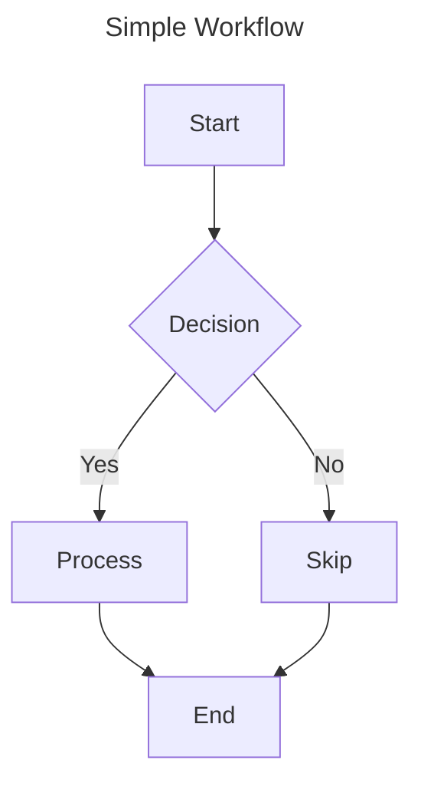

# Documentation Standards

This module provides guidelines for creating consistent documentation using Markdown and diagramming tools.

## 1. Markdown Guidelines

- Use proper heading hierarchy (don't skip levels)
- Maximum heading depth: 4 levels
- Add blank line before and after headings
- Use ATX-style headings with space after hash: `# Heading`
- Include YAML front matter for metadata

## 2. Code Blocks

- Use triple backticks with language specification
- Indent code blocks properly
- Add blank line before and after
- Use inline code for short references

```python
def example_function():
    """
    This is a docstring for the example function.
    
    Returns:
        str: A greeting message
    """
    return "Hello, Universe!"
```

Reference the `example_function()` in your documentation.

## 3. Callouts

Use blockquotes with emoji for different types of callouts:

> 🚨 **Warning:** Used for critical information that requires immediate attention.

> 💡 **Tip:** Used for helpful suggestions and best practices.

> ℹ️ **Note:** Used for additional context and information.

## 4. Tables

Use tables for structured data presentation:

| Name        | Type      | Description       |
|:------------|:---------:|------------------:|
| id          | number    | Primary key       |
| name        | string    | User's name       |
| email       | string    | Contact email     |

## 5. Mermaid Diagrams

Use Mermaid diagrams for visual documentation:

### When to Use Mermaid

- Workflows and processes
- System architecture
- Decision trees
- State machines
- Component relationships

### Diagram Best Practices

- Include clear titles using the `---` syntax
- Use descriptive node labels
- Keep diagrams focused and specific
- Use consistent direction (TD/LR/TB)

### Example Diagram



## 6. Document Structure

```markdown
---
title: Component Name
description: Brief description of component
version: 1.0.0
updated: YYYY-MM-DD
---

# Component Name

Brief introduction and purpose.

## Installation

Instructions for installation.

## Usage

Basic usage examples.

## API Reference

Detailed API documentation.

## Examples

Concrete usage examples.

## Troubleshooting

Common issues and solutions.
```

## 7. README Checklist

- Project title and description
- Installation instructions
- Basic usage example
- Configuration options
- Dependency list
- Troubleshooting section
- License information
- Contribution guidelines
- Changelog or version history
- Contact information or support channels

### Code Generation Standards

1. **Complete Code Files:**
   - Never use ellipsis (...) or shorthand in code
   - Provide complete, functional code files
   - Include all necessary imports
   - Include full error handling
   - Include comprehensive logging

2. **Code Documentation:**
   - Include complete header documentation
   - Document all major code sections
   - Include version information
   - Document all configuration options

3. **Code Structure:**
   - Maintain consistent formatting
   - Use proper indentation
   - Group related functionality
   - Follow naming conventions