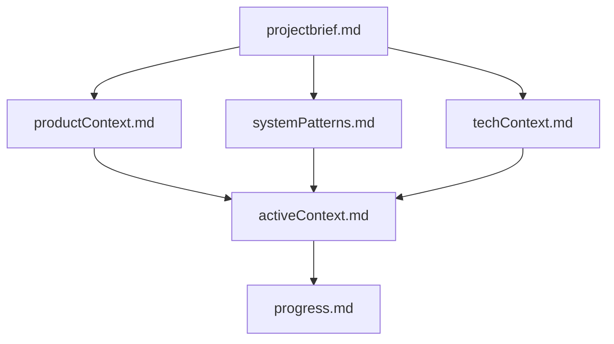
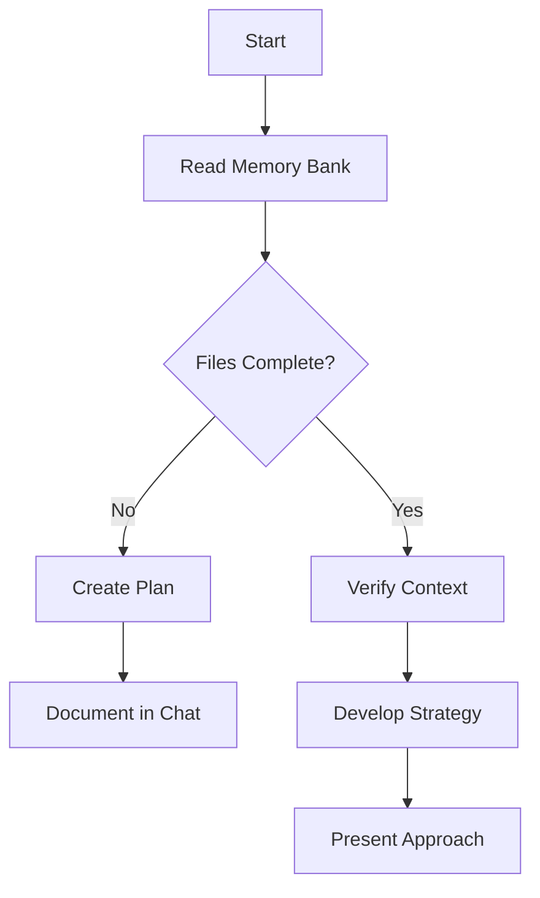
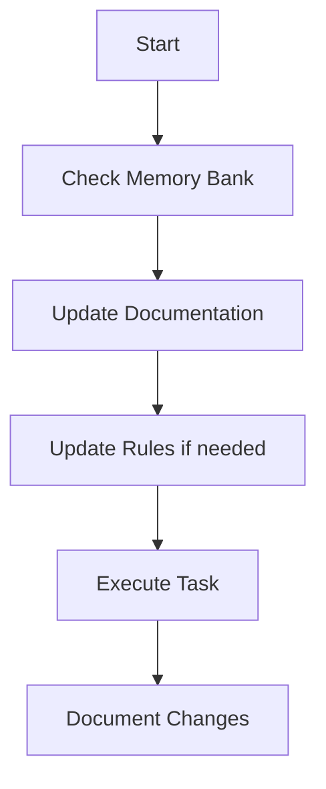
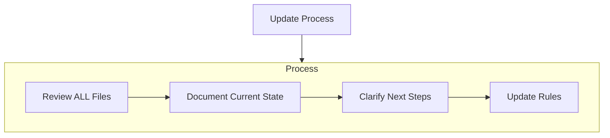
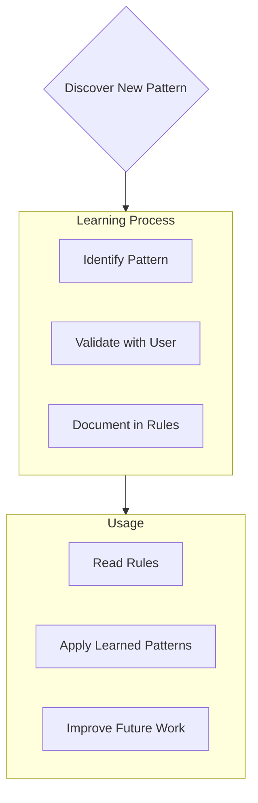

# Memory Bank Structure and Management

This document outlines the structure and management of the Memory Bank system, designed to maintain perfect documentation and context between sessions.

## Memory Bank Purpose

The Memory Bank serves as the central knowledge repository for projects, ensuring:
- Complete project understanding after context resets
- Consistent application of project patterns and decisions
- Clear documentation of current state and progress
- Effective continuation of development work across sessions

## Memory Bank Structure

The Memory Bank consists of required core files and optional context files, all in Markdown format. Files build upon each other in a clear hierarchy:

### Core Files (Required)

1. `projectbrief.md`
   - Foundation document that shapes all other files
   - Created at project start if it doesn't exist
   - Defines core requirements and goals
   - Source of truth for project scope

2. `productContext.md`
   - Why this project exists
   - Problems it solves
   - How it should work
   - User experience goals

3. `activeContext.md`
   - Current work focus
   - Recent changes
   - Next steps
   - Active decisions and considerations

4. `systemPatterns.md`
   - System architecture
   - Key technical decisions
   - Design patterns in use
   - Component relationships

5. `techContext.md`
   - Technologies used
   - Development setup
   - Technical constraints
   - Dependencies

6. `progress.md`
   - What works
   - What's left to build
   - Current status
   - Known issues

### Additional Context

Create additional files/folders within memory-bank/ when they help organize:
- Complex feature documentation
- Integration specifications
- API documentation
- Testing strategies
- Deployment procedures

## Core Workflows

### Plan Mode

### Act Mode

## Documentation Updates

Memory Bank updates occur when:
1. Discovering new project patterns
2. After implementing significant changes
3. When user requests with **update memory bank**
4. When context needs clarification

Note: When triggered by **update memory bank**, review every memory bank file, even if some don't require updates. Focus particularly on activeContext.md and progress.md as they track current state.

## Project Intelligence Rules

The project rules file captures important patterns, preferences, and project intelligence that help work more effectively. As the project develops, new patterns will be discovered and documented to ensure consistent implementation.

### What to Capture
- Critical implementation paths
- User preferences and workflow
- Project-specific patterns
- Known challenges
- Evolution of project decisions
- Tool usage patterns

The format is flexible - focus on capturing valuable insights that help work more effectively with the project. Think of project rules as a living document that grows smarter as development continues.

## Memory Initialization

When creating a Memory Bank for a new project:

1. Start with `projectbrief.md`
2. Create the core structure files
3. Initialize with known information
4. Update progressively as project understanding improves

REMEMBER: After every memory reset, you begin completely fresh. The Memory Bank is your only link to previous work. It must be maintained with precision and clarity, as effectiveness depends entirely on its accuracy.